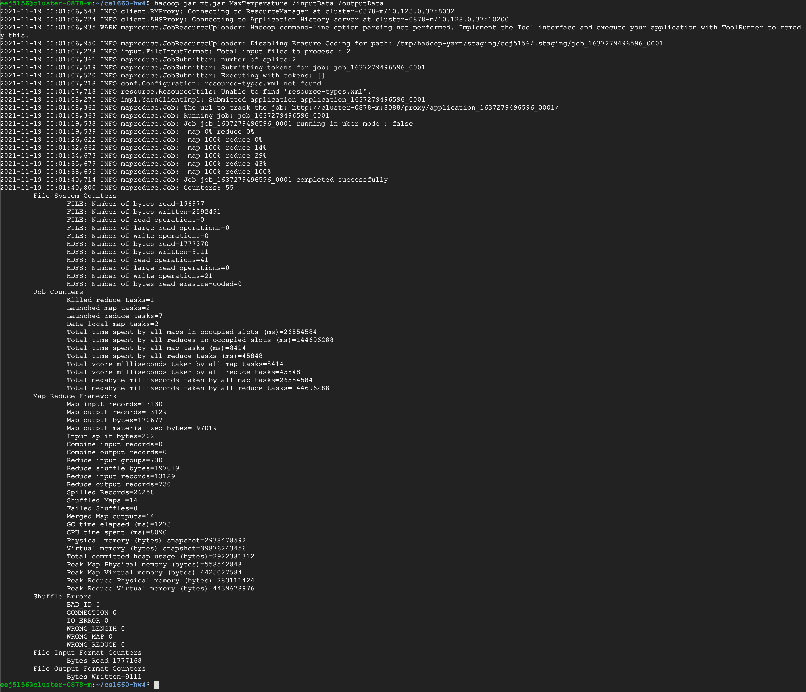

# cs1660-hw4

[Max Temperature Main](Docker/MaxTemperature.java)

[Max Temperature Mapper](Docker/MaxTemperatureMapper.java)

[Max Temperature Reducer](Docker/MaxTemperatureReducer.java)

[Results](Docker/mergedData)

[GUI Code](Docker/upload_gcp.py)

[Video Showcasing GUI](https://pitt-my.sharepoint.com/:v:/g/personal/ewj9_pitt_edu/Edv56_-ZpPZPh6xsAmboFdABxNSVZjHpNrOGYstknq_myA?e=tDBP78)
